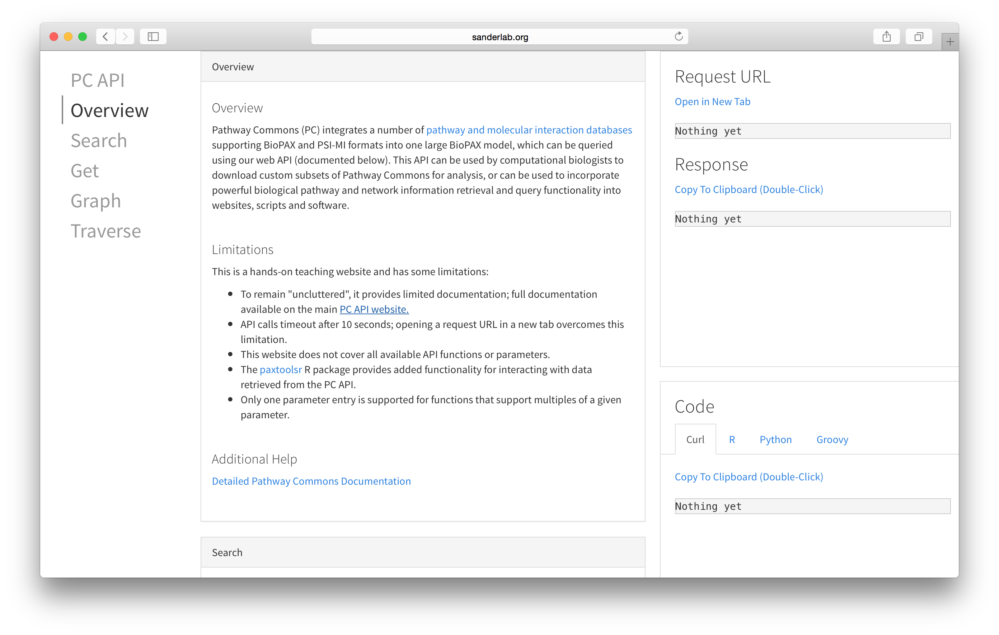

# Pathway Commons API Demonstration 

__*This is now somewhat outdated, and we're switching to Swagger and Spring REST docs.*__

A simple representation for the Pathway Commons API that can be used as part of an introduction and tutorial to Pathway Commons. 

[Live](http://pathwaycommons.github.io/pcapi/)

# Screenshot

